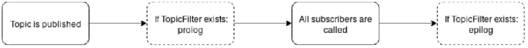

# RODOS

# Tutorial ABC (Alice Bob Charly)

### Author: S. Montenegro

## 1. How To begin (Steps to compile and execute a RODOS program)

Read and understand first the RODOS-Tutorial and then the RODOS-Middleware tutorial.

1. Open a Terminal using the **bash** shell
2. Enter the **RODOS root** directory
3. Set some shell variables that are needed by the compilation scripts

   ```
   source setenvs.sh
   ```

   It has to be executed **every time** when **opening a new terminal!**
4. Compile the RODOS library for a Linux x86 PC

   ```
   rodos-lib.sh linux-makecontext
   ```

    - shell completion with *tab* shows the alternatives
    - Has to be done **only once** for every RODOS version, unless something in folder src or api has been modified.
5. Enter the folder with the user program

   ```
   cd tutorials/30-communication-and-bbs/10-alice-bob-charly
   ```

6. You may use different ports and target architectures. In these examples we will use
   linux-make-context (`linux-makecontext`). To see the list of alternatives, see in the build-scripts directory the
   files in set-vars.
7. Compile the user program

   ```
   rodos-executable.sh linux-makecontext alice-bob-charly.cpp
   ```

8. Execute the binary

   ```
   ./tst
   ```

For each example programme please first read and understand the code, then compile and execute and see if it acts as
expected. Then modify and continue trying.

## 2. Useful to know

The middleware communication is based on a publisher/subscriber protocol. This is a multicast protocol. There is no
connection from a sender to a receiver (connectionless).

Publishers make messages public under a given topic. Subscribers to a given topic get all messages which are published
under the given topic. To establish a transfer path, both the publisher and subscriber have to share the same topic. A
Topic is a pair - data-type and an integer representing a topic identifier. To match a communication pair, both
data-type and topic identifier must match. For a topic there may be zero, one or several subscribers. A message which is
published under a topic will be distributed to 0 or more subscribers. Each subscriber has a reference to the associated
topic and a “putter” to store messages. Or in this more simple example threads may be waiting for messages. If a message
is published while a thread is waiting for it, the thread will get a copy of the message else not. All subscribers are
registered in a list. Each time a message is published the list of all subscribers will be searched and for each
subscriber where the topic matches the associated putter will be called to store a copy of the published message. Using
a network interface and the corresponding gateways, the middleware may make the node borders transparent. Applications
running on different computers may communicate as if they were on the same computer (not in this example).

## 3. Examples

#### alice_bob_charly.cpp

This is a short demonstration of threads communicating by publishing messages and threads waiting for them. To see more
elaborated publisher/Subscriber communication please refer to tutorial_middleware.

Alice, Bob and Charly share communication topics:

```
struct Greetings {
    int64_t date;
    char    msg[80];
};

Topic<Greetings> valentine(20, "valentine");
```

Bob publishes a message after 2 seconds:

```
#define VALENTINE_DAY	2*SECONDS
```

Alice waits for it. After Bob publishes the message (line 41), Alice can receive the message (line 54) she is waiting
for. Charly only receives the second message (sent in line 45) as Charly is only a TopicFilter and not a subscriber.
Charly only receives messages after set as a TopicFilter for valentine in line 44.

A topic may not have more than one filter. After the message is published, the prolog (line 20) is called, then all
subscribers (here only Alice), then the epilog (line 24).

#### Sequence of events after a Topic is published

